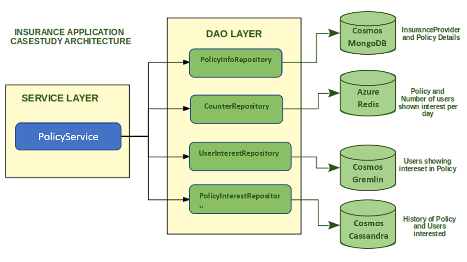

## Problem Statement: Implementing polyglot persistence with NoSQL databases on Azure cloud

The application to be implemented in this case study deals with Insurance policies and interest shown by the users for those policies
It allows insurance providers to add new policies. A user can then search the policies based on the provider name and show interest in policies.
The application captures the interest shown by users and helps the Insurance providers to obtain the below information from the stored data
    
 - Policies by Provider
 - Total number of users who showed interests on a specified policy
 - Users who showed interest in a given policy
 - History of interest data based on provider and policy for future reporting

The application stores data in four types of databases on Azure cloud based on the data requirements
    
 - Azure Cosmos For MongoDB(Document based): Stores the provider and policy information
 - Azure Cache For Redis(Key-value): Store the policy name and number of users shown interest as key-value pair
 - Azure Cosmos Gremlin(Graph): Stores Policy and User nodes and the relation between these nodes
 - Azure Cosmos for Cassandra(Column-store): Stores policy and user interest data based on time for future reporting 
    
Following is the high level process flow of the application :
    
- When a new policy is added, it should be stored in following databases
  - As a new policy along with provider Document database
  - As a Graph node
  - As a key in in-memory database with value as a counter of number of users(initialized with 0)
- When another new policy is created, it should be appended to the same provider
- When a user shows interest in a policy
  - A user node is added in graph database and a relation between user and policy is created
  - Counter is incremented key-value database for the policy
  - A history of the interest data is stored in column-store database
   
    

Note:
  - Policy names are unique across providers
  - Only email is stored for a user

 
### The following tasks needs to be completed as part of this casestudy 
  - Login to Azure portal (https://portal.azure.com) with your credentials
    - Create a Cosmos Account For MongoDB
    - Create a Cosmos Account For Gremlin(Graph)
    - Create a Cosmos Account For Cassandra
    - Create an account For Azure Cache for Redis

- Implement the functionality based on the comments provided in base code
- Ensure that all Test cases provided are successful for assignment completion
- Before running tests, ensure the code implementation is complete and databases are provisioned on AWS

## Instructions
- Take care of whitespace/trailing whitespace
- Do not change the provided class/method names unless instructed
- Ensure your code compiles without any errors/warning/deprecations
- Follow best practices while coding